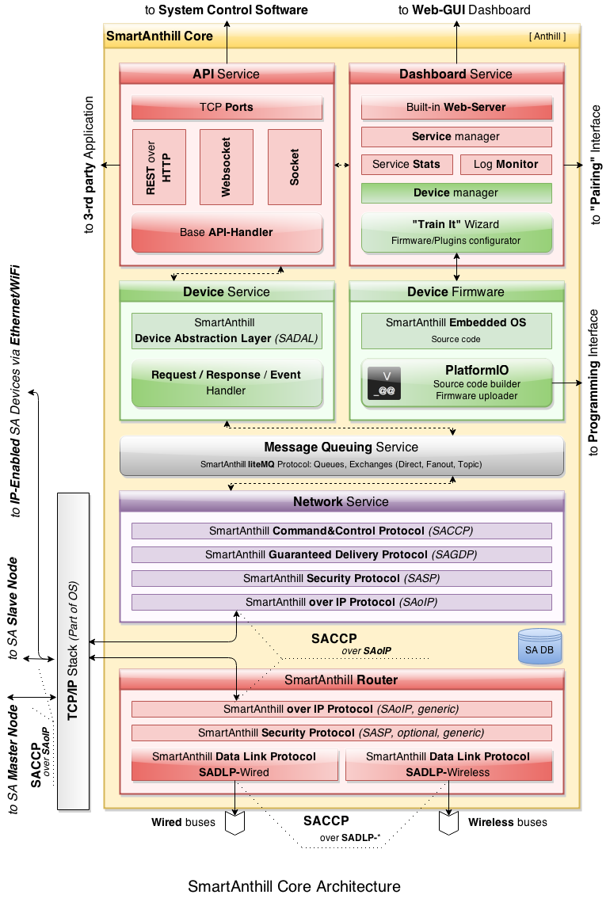

..  Copyright (c) 2015, OLogN Technologies AG. All rights reserved.
    Redistribution and use of this file in source (.rst) and compiled
    (.html, .pdf, etc.) forms, with or without modification, are permitted
    provided that the following conditions are met:
        * Redistributions in source form must retain the above copyright
          notice, this list of conditions and the following disclaimer.
        * Redistributions in compiled form must reproduce the above copyright
          notice, this list of conditions and the following disclaimer in the
          documentation and/or other materials provided with the distribution.
        * Neither the name of the OLogN Technologies AG nor the names of its
          contributors may be used to endorse or promote products derived from
          this software without specific prior written permission.
    THIS SOFTWARE IS PROVIDED BY THE COPYRIGHT HOLDERS AND CONTRIBUTORS "AS IS"
    AND ANY EXPRESS OR IMPLIED WARRANTIES, INCLUDING, BUT NOT LIMITED TO, THE
    IMPLIED WARRANTIES OF MERCHANTABILITY AND FITNESS FOR A PARTICULAR PURPOSE
    ARE DISCLAIMED. IN NO EVENT SHALL OLogN Technologies AG BE LIABLE FOR ANY
    DIRECT, INDIRECT, INCIDENTAL, SPECIAL, EXEMPLARY, OR CONSEQUENTIAL DAMAGES
    (INCLUDING, BUT NOT LIMITED TO, PROCUREMENT OF SUBSTITUTE GOODS OR
    SERVICES; LOSS OF USE, DATA, OR PROFITS; OR BUSINESS INTERRUPTION) HOWEVER
    CAUSED AND ON ANY THEORY OF LIABILITY, WHETHER IN CONTRACT, STRICT
    LIABILITY, OR TORT (INCLUDING NEGLIGENCE OR OTHERWISE) ARISING IN ANY WAY
    OUT OF THE USE OF THIS SOFTWARE, EVEN IF ADVISED OF THE POSSIBILITY OF SUCH
    DAMAGE

.. |PIO| replace:: `PlatformIO <http://platformio.org>`__

.. _sacorearch:

SmartAnthill 2.0 Core Architecture
==================================

:Version:   v0.1b

*SmartAnthill Core* represents a cross-platform software which is written in Python language and should support the popular operation systems (Mac OS X, Linux (+ARM) and Windows).

.. contents::

Requirements
------------

The requirements of *SmartAnthill Core* by the system resources should by very low:

* < 1% CPU in IDLE mode
* < 20Mb RAM for service/daemon
* < 20Mb of free disk space (the cross-compilers, tool chains and firmware upload software are not included here)


SmartAnthill Core Architecture
------------------------------



SmartAnthill Core Services
--------------------------

*SmartAnthill Core* operates on PC like a system foreground daemon with the
pieces of own services.

@TODO more explanation


API Service
```````````
*API Service* is responsible for receiving requests (via REST, WebSocket or Socket) from *System Control Software* and taking necessary measures to execute them via :ref:`saccp`.

@TODO more explanation

.. _sacorearchdashser:

Dashboard Service
`````````````````

*Dashboard Service* represents WEB-based GUI (requires browser with enabled JavaScript) which allows:

  + to manage :ref:`saoverdevices` (add, edit or remove them, customise with the specific capabilities/plugins/operations)
  + to generate and upload device-compatible firmware via "TrainIt" wizard (see explanation below in :ref:`sacorearchfbandu`)
  + to monitor *SmartAnthill Heterogeneous Network* in the real time (operational state of each device, the number of sent/received messages, errors and etc)
  + to analyze log messages

@TODO more explanation

Device Service
``````````````

* SmartAnthill Device Abstraction Layer (SADAL)
* Request/Response/Event Handler
* :ref:`sacorearchfbandu` via |PIO|

@TODO more explanation

Message Queuing Service
```````````````````````

SmartAnthill liteMQ Protocol:

* Queues
* Exchanges

    + Direct
    + Fanout
    + Topic

@TODO more explanation


Network Service
```````````````

*Network Service* is based on the :ref:`saprotostack` and operates with the network data (messages, packets, fragments) within *SmartAnthill Heterogeneous Network*.

@TODO more explanation

.. _sacorearchrouter:

SmartAnthill Router
-------------------

*SmartAnthill Router* is responsible for translating IP-based requests into bus-specific requests for :ref:`SmartAnthill Simple Devices <sasimpledev>` (also see document :ref:`saprotostack` for details).

*SmartAnthill Router* operates one or more 'buses'. Each SmartAnthill bus can be either a traditional wired bus (such as CAN bus), or a wireless 'bus'. Wireless SmartAnthill 'buses' do not imply any wired connection, they just represent certain domain of wireless connections; for example, one wireless 'bus' can be a IEEE 802.15.4 'bus' controlling some devices connected via IEEE 802.15.4, and at the same time another wireless 'bus' can be a 433 MHz RF 'bus' controlling some other devices connected via 433 MHz RF.
Each bus (wired or wireless) has one or more simple devices (such as sensors or actuators) connected to it (in case of wireless buses, the connection is wireless).
Each device runs an MPU (or in theory CPU), which runs SmartAnthill stack on it (either a reference stack, or some other implementation).

It should be noted that IP-enabled devices do not use SmartAnthill Router to operate; they can and SHOULD be addressed directly via their IP.


.. _sacorearchfbandu:

SmartAnthill Firmware Builder and Uploader
------------------------------------------

* `Supported boards/devices <http://platformio.org/#!/boards>`_
* `Supported development platforms <http://platformio.org/#!/platforms>`_

*SmartAnthill Firmware Builder* and Uploader is implemented on top of |PIO|.

@TODO |PIO| role should be explained here

SmartAnthill Database
---------------------

* Board settings
* Pre-configured plugins
* Application state
* Configs
