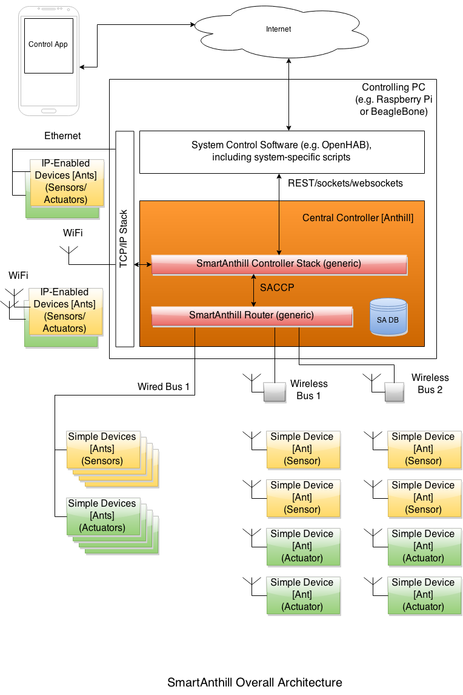
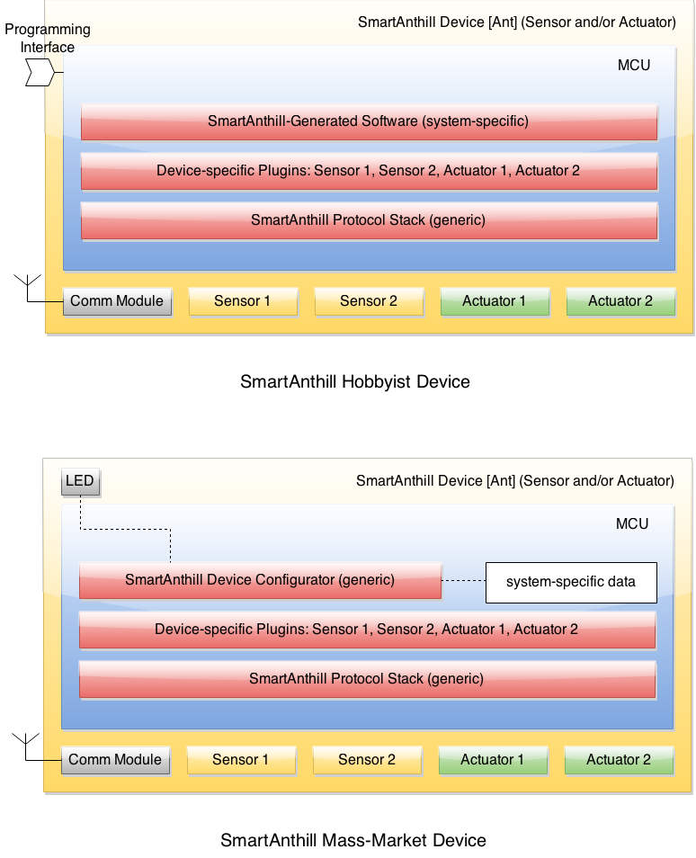

..  Copyright (c) 2015, OLogN Technologies AG. All rights reserved.
    Redistribution and use of this file in source (.rst) and compiled
    (.html, .pdf, etc.) forms, with or without modification, are permitted
    provided that the following conditions are met:
        * Redistributions in source form must retain the above copyright
          notice, this list of conditions and the following disclaimer.
        * Redistributions in compiled form must reproduce the above copyright
          notice, this list of conditions and the following disclaimer in the
          documentation and/or other materials provided with the distribution.
        * Neither the name of the OLogN Technologies AG nor the names of its
          contributors may be used to endorse or promote products derived from
          this software without specific prior written permission.
    THIS SOFTWARE IS PROVIDED BY THE COPYRIGHT HOLDERS AND CONTRIBUTORS "AS IS"
    AND ANY EXPRESS OR IMPLIED WARRANTIES, INCLUDING, BUT NOT LIMITED TO, THE
    IMPLIED WARRANTIES OF MERCHANTABILITY AND FITNESS FOR A PARTICULAR PURPOSE
    ARE DISCLAIMED. IN NO EVENT SHALL OLogN Technologies AG BE LIABLE FOR ANY
    DIRECT, INDIRECT, INCIDENTAL, SPECIAL, EXEMPLARY, OR CONSEQUENTIAL DAMAGES
    (INCLUDING, BUT NOT LIMITED TO, PROCUREMENT OF SUBSTITUTE GOODS OR
    SERVICES; LOSS OF USE, DATA, OR PROFITS; OR BUSINESS INTERRUPTION) HOWEVER
    CAUSED AND ON ANY THEORY OF LIABILITY, WHETHER IN CONTRACT, STRICT
    LIABILITY, OR TORT (INCLUDING NEGLIGENCE OR OTHERWISE) ARISING IN ANY WAY
    OUT OF THE USE OF THIS SOFTWARE, EVEN IF ADVISED OF THE POSSIBILITY OF SUCH
    DAMAGE

.. _saoverarch:

SmartAnthill 2.0 Overall Architecture
=====================================

:Version:   v0.3

**SmartAnthill** is an open IoT system which allows easy control over multiple microcontroller-powered devices, creating a home- or office-wide heterogeneous network out of these devices.

SmartAnthill system can be pretty much anything: from a system to control railway network model to an office-wide heating control and security system.  As an open system, SmartAnthill can integrate together a wide range of devices beginning from embedded development boards and ending with off-the-shelf sensors and actuators. They can be connected via very different communication means - from wired (currently Serial, with CAN bus and Ethernet planned soon) to wireless (currently IEEE 802.15.4, with low-cost RF, Bluetooth Smart, ZigBee and WiFi planned soon).

All SmartAnthill devices within a system are controlled from the one place (such as PC or credit-card sized computer Raspberry Pi, BeagleBoard or CubieBoard), with an optional access via Internet.

From programming point of view, SmartAnthill provides a clear separation between microcontroller programming (such as "how to get temperature from this sensor") and system integration logic (such as "how we should heat this particular house to reduce the heating bill"). Microcontroller programming usually requires C/asm programming and C/asm programs are notoriously difficult to customize. SmartAnthill allows you to customise device with pre-defined capabilities via GUI and generate compatible firmware which will be flashed to device automatically. On the other hand, system integration logic needs to be highly customizable for needs and properties of specific house or office, but within SmartAnthill it can be done via rich suite of development instruments: Generic Protocols (HTTP, Sockets, WebSokets), High Level API (REST API) and SDK for popular languages, which allow for easy development and customization.

SmartAnthill 2.0 represents further work on SmartAnthill 1.0, which was designed solely by Ivan Kravets, an author of `PlatformIO <http://platformio.org>`_.  Improvements in SmartAnthill 2.0 cover several areas, from introducing security, to support of protocols such as ZigBee and improvements aimed at reducing energy consumption. SmartAnthill 2.0 is not intended to be compatible with SmartAnthill 1.0.

.. contents::

Aims
----

SmartAnthill aims to create a viable system of control for the Internet of Things (IoT) devices in home and office environments. More secure and more risky environments (such as industrial control, military, etc.) are currently out of scope.
Due to SmartAnthill roots in hardware hobbyist movement, special attention is to be paid for hobbyist needs.

Requirements
------------

SmartAnthill is built around the following requirements. They follow from the aims and generally are not negotiable.

1. **Low Cost**. In home/office environments SmartAnthill should aim for a single device (such as sensor) to be in the range of $10-$20. Rationale: higher costs will deter acceptance greatly.

2. **Support for Devices with Limited Resources**. Many of devices and MPUs aimed to be used with SmartAnthill are very limited in their resources (which is closely related to their low cost). Currently, minimal MPU configuration which minimal SmartAnthill aims to run on, is as low as 512 bytes RAM, 16K bytes PROM (to store the program) and 256 bytes EEPROM. [TODO: think about number of rewrites in EEPROM, incl. optimization]

3. **Wireless Support**. SmartAnthill needs to support wireless technologies. Wired support is optional. Rationale: without wireless devices, acceptance in home environments is expected to be very low.

4. **Support for Heterogeneous Systems**. SmartAnthill should allow to create systems consisting of devices connected via different means. ZigBee and RF technologies are of the particular interest.

5. **System Integration should not require asm or C programming**. Most MPUs require C or asm programming. This is ok, as long as such programming can be done once per device type and doesn't need to be repeated when the system integrator needs to adjust system behavior. To achieve it, SmartAnthill should provide clear separation between device developer and system integrator, and system integration should not require C or asm programming skills.

6. **Energy Efficiency**. SmartAnthill should aim to achieve best energy efficiency possible. In particular, a wide range of SmartAnthill sensors should be able to run from a single 'tablet'-size battery for at least a year (more is better).

7. **Security**. SmartAnthill should provide adequate protection given the home/office environment. In other words, SmartAnthill as such doesn't aim to protect from NSA (or any other government agency) or from somebody who's already obtained physical access to the system. However:

   a) protection from remote attackers (both over the Internet and present within the reach of wireless communications) is the must
   b) level of protection should be sufficient to control home/office physical security systems
   c) protection from local attackers trying to obtain physical entry requires additional physical security measures, which can be aided by SmartAnthill. For example, if the attacker gets entrance to the hardware of SmartAnthill Central Controller, SmartAnthill becomes vulnerable. However, SmartAnthill-enabled sensors may be installed to detect unauthorized entrance to the room where SmartAnthill is installed, and/or to detect unauthorized opening of the SmartAnthill Central Controller physical box, with an appropriate action taken by Central Controller before it becomes vulnerable (for example, notifying authorities).

8. **Openness**. All core SmartAnthill technologies should be open. SmartAnthill protocols are intended to be published, and any device compliant with these protocols should be able to interoperate with other compliant devices. SmartAnthill project will provide a reference software stack as an open source code, which will be distributed under GPL v2 [TODO:decide] license.

   a) Openness of SmartAnthill does not mean that all SmartAnthill devices should use open-source software. Any device, whether using open- or closed-source software, is welcome as long as it complies with published SmartAnthill protocols.
   b) Openness of SmartAnthill does not mean that SmartAnthill devices are not allowed to use existing proprietary protocols as a transport.
   c) Position on patents. SmartAnthill Core MUST use patent-free technologies wherever possible. Support for patented technologies as a transport is allowed. All SmartAnthill contributors MUST fill a form with a statement on their knowledge on patents related to their contribution.

9. **Vendor and Technology Neutrality**. SmartAnthill should not rely on any single technology/platform (leave alone any single vendor). All kinds of suitable technologies and platforms are welcome. Any references to a specific technology should be considered only as an example.

10. **Extensibility**. Closely related to technology neutrality is extensibility. SmartAnthill should expect new technologies to emerge, and should allow them to be embraced in a non-intrusive manner. It is especially important to allow easy addition of new communication protocols, and of new devices/MPUs.

11. **Ability to Utilize Resources of More Capable Devices**. Non-withstanding Requirement #2 above, it is recognized that there are some devices out there which have better capabilities than minimal capabilities. Moreover, it is recognized that share of such more capable devices is expected to grow. Therefore, as long as it is helpful to achieve any of the goals above, SmartAnthill should allow to utilize capabilities of more sophisticated devices. One example is to utilize device's ability to sleep and wake up on timer, allowing to improve battery life greatly. Another example is to allow combining several commands into one wireless transmission, allowing to reduce amount of time wireless module needs to be turned on, which should also help improving battery life.

    a) It doesn't mean that SmartAnthill is going to increase minimal requirements. However, if minimal requirements are exceeded by any particular device, SmartAnthill should allow to utilize those improved capabilities to improve other user-observable characteristics.

12. **Support both for mass-market devices and for hobbyist devices**. While SmartAnthill is not limited to hobbyists and aims to become a widely-accepted network for controlling IoT and smart homes, it should consider hobbyists as a first-class citizens and pay attention to their needs. In particular, compatibility with existing devices and practices is to be taken seriously, as well as any feedback.

SmartAnthill Architecture
-------------------------

General Architecture
^^^^^^^^^^^^^^^^^^^^
Simple SmartAnthill system consists of one *SmartAnthill Central Controller* and one or more devices controlled by it (see *SmartAnthill Overall Architecture* diagram above for an example topology).

*SmartAnthill Central Controller* is a relatively complex device (such as PC or credit-card sized computer Raspberry Pi, BeagleBoard or CubieBoard) which normally runs several pieces of software: System Control Software, SmartAnthill Core and SmartAnthill Router.

.. _saoversyscsoft:

System Control Software
^^^^^^^^^^^^^^^^^^^^^^^

*System Control Software* is intended to be easily customizable according to customer needs. It can be very different, but we aim to support OpenHAB, and to support pretty much any programming languages which can support one of the REST, WebSockets or Sockets. SmartAnthill project as such doesn't provide control software, it is rather a service which can be used by a control software.

.. _saovercore:

SmartAnthill Core
^^^^^^^^^^^^^^^^^

*SmartAnthill Core* represents a cross-platform software which is written in Python language and should support the popular operation systems (Mac OS X, Linux (+ARM) and Windows). The requirements of *SmartAnthill Core* by the system resources should by very low:

* < 1% CPU in IDLE mode
* < 20Mb RAM for service/daemon
* < 20Mb of free disk space (the cross-compilers, tool chains and firmware upload software are not included here)

SmartAnthill Core Services
''''''''''''''''''''''''''

*SmartAnthill Core* operates on PC like a system foreground daemon with the
following own services:

* **Dashboard Service** represents WEB-based GUI (requires browser with enabled JavaScript) which allows:

  + to manage :ref:`saoverdevices` (add, edit or remove them, customise with the specific capabilities/plugins/operations)
  + to generate and upload device-compatible firmware via "TrainIt" wizard (see explanation below in :ref:`saovercorefirmbau`)
  + to monitor *SmartAnthill Heterogeneous Network* in the real time (operational state of each device, the number of sent/received messages, errors and etc)
  + to analyze log messages
* **Network Service** is based on the :ref:`saprotostack` and operates with the network data (messages, packets, fragments) within *SmartAnthill Heterogeneous Network*.
* **API Service** is responsible for receiving requests (via REST, WebSockets or Sockets) from *System Control Software* and taking necessary measures to execute them via :ref:`saccp`.

.. _saovercorefirmbau:

SmartAnthill Firmware Builder and Uploader
''''''''''''''''''''''''''''''''''''''''''

@TODO PlatformIO role should be explained here

.. _saoverrouter:

SmartAnthill Router
^^^^^^^^^^^^^^^^^^^

*SmartAnthill Router* is responsible for translating IP-based requests into bus-specific requests for :ref:`SmartAnthill Simple Devices <sasimpledev>` (also see document :ref:`saprotostack` for details).

*SmartAnthill Router* operates one or more 'buses'. Each SmartAnthill bus can be either a traditional wired bus (such as CAN bus), or a wireless 'bus'. Wireless SmartAnthill 'buses' do not imply any wired connection, they just represent certain domain of wireless connections; for example, one wireless 'bus' can be a IEEE 802.15.4 'bus' controlling some devices connected via IEEE 802.15.4, and at the same time another wireless 'bus' can be a 431 MHz RF 'bus' controlling some other devices connected via 431 MHz RF.
Each bus (wired or wireless) has one or more simple devices (such as sensors or actuators) connected to it (in case of wireless buses, the connection is wireless).
Each device runs an MPU (or in theory CPU), which runs SmartAnthill stack on it (either a reference stack, or some other implementation).

It should be noted that IP-enabled devices do not use SmartAnthill Router to operate; they can and SHOULD be addressed directly via their IP.

TODO: Master-Slave topology!

.. _saoverdevices:

SmartAnthill Devices
^^^^^^^^^^^^^^^^^^^^

Each *SmartAnthill Device* (also known as 'Ant') is either *SmartAnthill Hobbyist Device*, or a *SmartAnthill Mass-Market Device*. While these devices are similar, there are some differences as outlined below. In addition, in a completely different and independent dimension each SmartAnthill Device is either a "Simple Device", or an "IP-enabled Device".

These properties are independent of each other, so it is possible to have all four different types of devices: SmartAnthill Hobbyist Simple Device, SmartAnthill Hobbyist IP-enabled Device, SmartAnthill Mass-Market Simple Device, and SmartAnthill Mass-Market IP-enabled Device.

.. _saoverhobdev:

SmartAnthill Hobbyist Device
''''''''''''''''''''''''''''

A diagram of a typical *SmartAnthill Hobbyist Device* is provided in section :ref:`saoverdevices`. SmartAnthill Hobbyist Device consists of an MCU, communication module, and one or more sensors and/or actuators (which are also known as 'ant body parts'). MCU on SmartAnthill Hobbyist Device runs several layers of software:

* **SmartAnthill-Generated Software** it is system-specific, i.e. it is generated for each system
* **Device-Specific Plugins** for each type of sensor or actuator present
* :ref:`saprotostack` protocol stack is generic, i.e. it is intended to be pretty much the same for all SmartAnthill Devices

An important part of *SmartAnthill Hobbyist Device* (which is absent on SmartAnthill Mass-Market Devices) is programming interface; for example, it can be some kind of SPI, UART or USB.

.. _saovermmdev:

SmartAnthill Mass-Market Device
'''''''''''''''''''''''''''''''

A diagram of a typical *SmartAnthill Mass Market Device* is also provided in the section :ref:`saoverdevices`. In addition to the components available on *SmartAnthill Hobbyist Device*, *SmartAnthill Mass-Market Device* additionally includes:

* **Persistent Storage** (such as EEPROM) to store system-specific data. System-specific data contains things such as bus-specific addresses and security keys; it is obtained during "pairing" process which is described below
* **"Pairing" Interface** and **"Pairing" Module** responsible for handling "pairing" interface. "pairing" interface is used during "pairing" process as described below, and can be, for example, NFC or USB interface to handle USB stick.

MCU on *SmartAnthill Mass-Market Device* runs several layers of software (note the differences from :ref:`saoverhobdev`):

* **SmartAnthill Configurator**, which is responsible for handling "pairing" process and populating system-specific data. SmartAnthill Configurator is generic.
* **Device-Specific Plugins** for each type of sensor or actuator present
* :ref:`saprotostack` as noted above, protocol stack is generic.

.. _sasimpledev:

SmartAnthill Simple Device
''''''''''''''''''''''''''

Many of SmartAnthill Devices are expected to have very little resources, and might be unable to implement IP stack. Such devices implement a portion of :ref:`saprotostack`, with *SmartAnthill Router* providing interface to the outside world and conversion between IP-based requests/replies and *Simple Device* requests/replies.

SmartAnthill IP-enabled Device
''''''''''''''''''''''''''''''

SmartAnthill IP-enabled Device is a device which is able to handle IP requests itself. Such devices can be accessed without the assistance of SmartAnthill Router.

Life Cycle of SmartAnthill Device
^^^^^^^^^^^^^^^^^^^^^^^^^^^^^^^^^
Let's consider how new devices are added and used within a SmartAnthill. Life cycle is a bit different for :ref:`saoverhobdev` and :ref:`saovermmdev`.

Life Cycle of SmartAnthill Hobbyist-Oriented Device
'''''''''''''''''''''''''''''''''''''''''''''''''''
During it's life within SmartAnthill, a hobbyist-oriented device goes through the following stages:

* **Initial State**. Initially (when shipped to the customer), Hobbyist-oriented SmartAnthill Device doesn't need to contain any program. Program will be generated and device will be programmed as a part of 'Program Generation and Programming' stage. Therefore, programming connector is a must for hobbyist-oriented devices.

* **Specifying Configuration**. Done by a user (hobbyist) using a *SmartAnthill Dashboard*. User selects board type and then specifies connections of sensors or actuators to different pins of the board. For example, one hobbyist might specify that she has [TODO] board and has a LED connected to pin 1, a temperature sensor connected to pins 2 through 5, and a DAC connected to pins 7 to 10.

* **Program Generation and Programming**. Done by *SmartAnthill Dashboard* automagically based on configuration specified in a previous step. Generated program includes a SmartAnthill stack, credentials necessary to authenticate the device to the network and vice versa (as described in SATP section below, authentication is done via symmetric keys), and subprograms necessary to handle devices specified in a previous step. Currently SmartAnthill supports either UART-programmed devices, or SIP-programmed devices [TODO:check]

After the device is programmed, it is automatically added to a *SmartAnthill Database* of available devices (this database is stored on Central Controller and is not intended to be shared). In this database, at least the following information is stored: credentials (i.e. symmetric keys), configuration (i.e. which device is connected to which pins), and device capabilities (i.e. amount of RAM/PROM/EEPROM available, MPU type/capabilities etc.)

* **Operation**. After the device is programmed, it can start operation. Device operation involves receiving and executing commands from Central Controller. Operations can be either device-specific (such as “measure temperature and report”), or generic (such as “wait for XXXX seconds and come back for further instructions”).

Life Cycle of SmartAnthill Mass-Market-Oriented Device
''''''''''''''''''''''''''''''''''''''''''''''''''''''
Mass-market devices are expected to be shipped in already programmed state, with a pre-defined configuration. Expected life cycle of a *SmartAnthill Mass-market-oriented Device* can be described as follows:

* **Initial State**. Initially (when shipped to the customer), SmartAnthill mass-market-oriented device does contain a program which ensures it's operation. Re-programming capability and connector are optional for SmartAnthill mass-market-oriented devices.

* **“Pairing” with Central Controller**. This includes Central Controller generating and exchanging credentials with device, querying device configuration and capabilities, and entering credentials, configuration and capabilities into SmartAnthill Database.

  - Physically, “pairing” can be done in several different ways [TODO: check feasibility of each]:

    + Using direct NFC (moving NFC-enabled device close to NFC-enabled Central Controller)

    + Using indirect NFC. It means: first, launching SmartAnthill-pairing app on an NFC-enabled smartphone; second, bringing the smartphone physically close to Central Controller; third, bringing the smartphone physically close to the device; fourth, bringing the smartphone physically close to Central Controller again.

    + Using USB flash. Will need to insert USB flash stick sequentially: to Central Controller, to USB-enabled device, and again to Central Controller.

  - Special considerations: to achieve reasonable levels of security, SmartAnthill Device MUST NOT allow to extract credentials; the only action allowed is to re-pair device with a different Central Controller, destroying previously existing credentials in the process. In other words, while it is possible to steal device to use with a different Central Controller, it should not be possible to impersonate device without access to Central Controller.

* **Operation**. Operation of Mass-market-oriented device is the same as operation of Hobbyist-oriented device.

SmartAnthill protocol stack
^^^^^^^^^^^^^^^^^^^^^^^^^^^
SmartAnthill protocol stack is described in detail in a separate document,
:ref:`saprotostack`.

